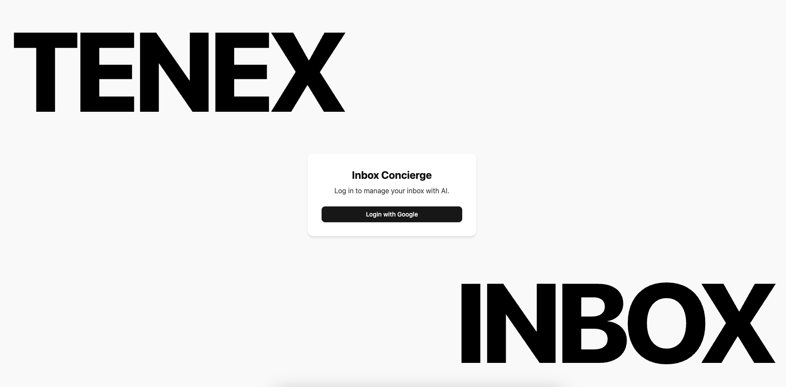

# Inbox Concierge

Inbox Concierge is a full-stack web application designed to help users manage their Gmail inbox with an intelligent, AI-powered classification system. This README provides a high-level overview of the project's architecture and technical design.

## Architecture Overview

The project is structured as a `pnpm` monorepo, which provides a single source of truth for all code and simplifies dependency management and tooling across the different parts of the application.

The monorepo contains two primary applications:

- `apps/api`: A Node.js/Express backend that handles business logic, data persistence, and communication with the Google Gmail API.
- `apps/web`: A React/Vite frontend that provides the user interface.

## Screenshots

|                                       Login Page                                        |                                       Inbox Page                                        |
| :-------------------------------------------------------------------------------------: | :-------------------------------------------------------------------------------------: |
|  |  |

|                                        Thread Page                                        |                                         Manage Buckets                                          |                                        Manage Rules                                         |
| :---------------------------------------------------------------------------------------: | :---------------------------------------------------------------------------------------------: | :-----------------------------------------------------------------------------------------: |
|  |  |  |

## Documentation

- **[Backend Documentation](./apps/api/README.md)**
- **[Frontend Documentation](./apps/web/README.md)**

## Getting Started: Running Locally

### Prerequisites

- Node.js (v18 or higher recommended)
- `pnpm` package manager (can be installed with `npm install -g pnpm`)

### 1. Installation

Clone the repository and install the dependencies:

```sh
git clone git@github.com:Jasonbrown7/inbox-concierge.git
cd inbox-concierge
pnpm install
```

### 2. Environment Setup

This project requires an `.env` file in the `apps/api` directory for credentials. For the purpose of this review, this file has been shared separately. Please place it in the correct directory (./apps/api)

### 3. Database Setup

Set up the SQLite database and apply the latest schema:

```sh
pnpm --filter @inbox-concierge/api run prisma:dev
```

### 4. Run the Application

Run both the frontend and backend servers concurrently. From both "./apps/api" and "./apps/web" run:

```sh
pnpm dev
```

The frontend will be available at `http://localhost:5173` and the API server at `http://localhost:4000`.

### 5. Running Tests

You can run the unit tests with the following command.

**Backend (API):**

```sh
pnpm --filter @inbox-concierge/api test
```

## Core Design & Data Flow

### Authentication

User authentication is handled via a secure Google OAuth 2.0 flow managed by the backend using Passport.js.

1.  The user initiates the login from the frontend, which redirects them to Google's consent screen.
2.  Upon successful authentication, Google redirects back to the API with an authorization code.
3.  The backend exchanges this code for an access token and a refresh token.
4.  A `User` record is created or updated in the database. The sensitive `refreshToken` is encrypted using `aes-256-gcm` before being stored.
5.  A secure, `httpOnly` session cookie is sent to the user's browser to manage their authenticated state for subsequent API requests.

### Data Storage & Synchronization

The application employs a hybrid approach to data management to ensure a fast user experience while maintaining data integrity and efficiency.

- **Database**: The backend uses a database (SQLite for development) managed by the Prisma ORM.
- **What is Stored**: The database only stores lightweight metadata for email threads (e.g., thread ID, subject, sender, snippet, date). The full body content of emails is never stored locally.
- **Synchronization**: A dedicated `/api/threads/sync` endpoint intelligently fetches this metadata from the Gmail API. On the first run, it fetches the user's most recent threads. On subsequent runs, it only fetches threads that are newer than the last one stored, minimizing redundant API calls.

### AI Classification Pipeline

On initial load, the application automatically syncs the user's latest email metadata from Gmail. Immediately following the sync, a multi-stage classification pipeline runs on the backend:

1.  **Heuristics:** Fast, deterministic checks identify common email types like newsletters and transactional messages.
2.  **LLM Classification:** Any remaining uncategorized emails are sent in batches to a Large Language Model (e.g., GPT-4o-mini). The LLM is dynamically provided with the user's complete set of buckets—including any custom ones they've created, allowing for nuanced classification into categories like "Important," "Can wait," or user-defined buckets like "Finance"
3.  **Rules Engine:** After classification, a "rules override" pass is performed. This pass applies any user-created rules. Rule priority is handled automatically based on the importance of the target bucket (e.g., "Important" rules run before "Newsletter" rules), with a manual "high-priority" option available for resolving conflicts. This ensures user preferences are the final word. The entire process is triggered on load and can be manually re-run by the user.

### Backend & Frontend Interaction

The frontend and backend communicate via a RESTful API.

- The frontend uses a pre-configured Axios instance to make authenticated requests to the backend, automatically including the session cookie.
- Server state on the frontend is managed by TanStack Query (React Query), which handles data fetching, caching, and state synchronization (e.g., automatically refetching threads after a sync operation).
- To view the full content of an email thread, the frontend makes an on-demand "lazy-loading" request to a dedicated backend endpoint (`GET /api/threads/:id`). The backend then fetches the full content for that single thread directly from the Gmail API and returns it. This ensures the main inbox view remains fast and that heavy data is only transferred when explicitly needed.
